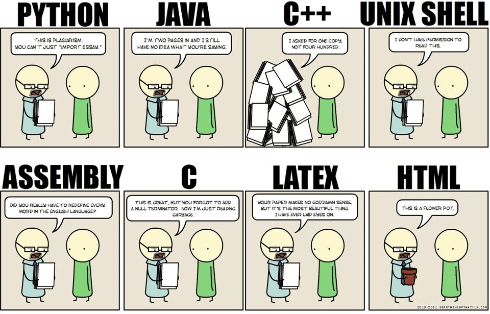

# Plotting in Python
Scripts and data used for the "Computer Programming for Big Data Biomedicine" class
## Before the class
+ We will need to use the following softwares and packages/modules:
	- Python2 or Python3
	- pip
	- iPython Notebook
	- Python modules: numpy, matplotlib, seaborn, mpld3

To check if your computer have those softwares/modules installed, open a Terminal or Command Prompt and type:
```
$ python -V
$ pip -V
$ ipython notebook -V
```

### Instructions for installing python modules:
Install pip if you don't have pip installed by downloading the [get-pip.py](https://bootstrap.pypa.io/get-pip.py) script. Then cd to the directory and run:

```
$ python get-pip.py
```
You may have to add `sudo` to run the command if you are on a Mac or Linux.

Install iPython notebook:
```
$ pip install "ipython[notebook]"
```

To test if the iPython notebook is successfully installed: 
```
$ ipython notebook
```

Check if python modules exist by 
```python
$ python
>>> import numpy
>>> import matplotlib
>>> import seaborn
>>> import mpld3
```
If any of those modules doesn't exist, use pip to install them:
```
$ pip install seaborn
```

If you run into errors when using pip to install packages on a Windows, especially for numpy, try downloading the .whl file from [this link](http://www.lfd.uci.edu/~gohlke/pythonlibs) and run 
```
pip install the-package-name.whl
```

## Why Python?
+ Elegant syntax
	- concise, human-readable
+ Extensive ranges of applications supported by third-party modules (packages)
	- Web development
	- Database
	- **Scientific computing**
	- Game development

## Import packages


## Installing Python packages
+ Where to find them?
	- Official website of the package
	- [Python Package Index(PyPI)](https://pypi.python.org/pypi)
	- A large collection of Windows binaries: [http://www.lfd.uci.edu/~gohlke/pythonlibs](http://www.lfd.uci.edu/~gohlke/pythonlibs/)
	- Source code repositories: [GitHub](https://github.com/), [Bitbucket](https://bitbucket.org/)
+ Types and install instructions:
	- Registered on PyPI: `pip install package`
	- .whl file: `pip install package.whl`
	- A directory with setup.py file: `python setup.py install`
	- .exe Windows binary: double click and follow the instructions

## Plotting libraries in python
+ [Matplotlib](http://matplotlib.org/index.html)
	- The basic and stable 2D plotting library
	- Similar to MATLAB
	- Highly customizable figures
+ [ggplot](http://ggplot.yhathq.com/)
	- Professional looking figures
	- Similar to R’s ggplot2
+ [Seaborn](http://stanford.edu/~mwaskom/software/seaborn/#) (statistical data visualization)
	- Wrapper of Matplotlib
	- high-level interface for drawing attractive statistical graphics
+ [Mpld3](http://mpld3.github.io/index.html)
	- Bring together matplotlib and [d3.js](http://d3js.org/)
	- Convert matplotlib figures to interactive web compatible figures

## Get some data to plot
+ Download everything here: 
	- [https://github.com/wangz10/plot_with_python](https://github.com/wangz10/plot_with_python)
+ How to import packages

## Numpy N-dementional array
+ A multidimensional container of items of the same type and size
+ Efficient for indexing and arithmetic operations
+ Creation:
	- From Python array_like objects: `lists`, `tuples` 
	- Intrinsic numpy functions: `np.arange`, `np.zeros`
	- From files: `np.loadtxt`
+ Indexing

## Hands on
Please refer to the [notebook](http://nbviewer.ipython.org/github/wangz10/plot_with_python/blob/master/plots.ipynb)

## Thanks for your attention!
+ Questions?
	- [zichen.wang@mssm.edu](mailto:zichen.wang@mssm.edu)
